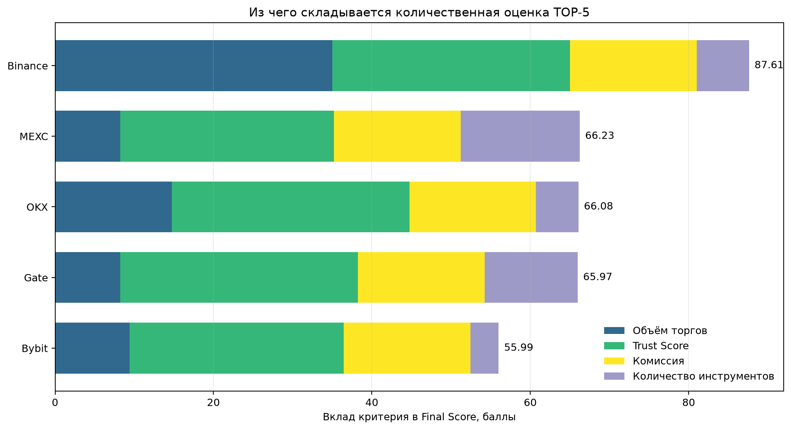
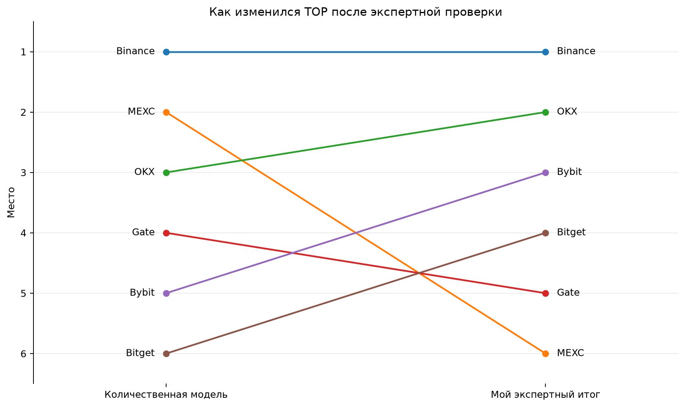

# Итоговый анализ бирж

## 1. Криптовалютные биржи

### Что именно ранжирует модель

Сначала я сравнила биржи по четырём показателям, которые удалось привести к единой числовой шкале:

- **Trading Volume** — объем торгов, отражающий масштаб и торговую активность площадки;
- **Trust Score** — оценка надежности биржи;
- **Trading Fees** — уровень торговых комиссий;
- **Number of Trading Instruments** — количество доступных торговых инструментов.

Полный процесс обработки данных, нормализация, расчет итоговой оценки и формирование рейтинга представлены в Jupyter Notebook в папке [`notebooks`](notebooks/).

После нормализации показателей и применения весов получился следующий TOP-5:

| Место | Биржа | Final Score |
|---:|---|---:|
| 1 | Binance | 87.61 |
| 2 | MEXC | 66.23 |
| 3 | OKX | 66.08 |
| 4 | Gate | 65.97 |
| 5 | Bybit | 55.99 |

TOP-5 по `Final Score` показывает результат сравнения только по показателям, включённым в расчёт. Это рейтинг по формуле, а не ответ на вопрос «какая биржа лучше во всём». Чтобы сделать итоговый вывод, я дополнительно учитывала положение площадки на рынке, специализацию на деривативах, прозрачность резервов, устойчивость инфраструктуры и механизмы защиты пользователей.

Диаграмма объясняет, почему MEXC заняла второе место и немного опередила OKX и Gate. У неё максимальный балл за количество инструментов и высокий балл за комиссии. При этом вклад торгового объёма у MEXC заметно ниже, чем у Binance и OKX, а Trust Score в исходной выборке составляет 9 из 10 против 10 из 10 у OKX и Gate. Иными словами, второе место MEXC — понятный результат формулы, но не безусловное преимущество площадки по всем характеристикам.

### Мой экспертный итог исследования

После расчёта я отдельно посмотрела на характеристики, которых нет в формуле: специализацию площадки, значение для рынка деривативов, раскрытие резервов и дополнительные механизмы защиты пользователей. Это не второй математический рейтинг. Это моя независимая оценка результатов исследования, поэтому она неизбежно содержит экспертное суждение. Я привожу её отдельно, чтобы не смешивать рассчитанные баллы с собственной интерпретацией.
#### 1. Binance

Binance занимает первое место и по формуле, и в моей итоговой оценке. В модели биржа получила 87.61 балла и заметно опередила остальные площадки.

Преимущество Binance заключается в сочетании крупного торгового объема, широкого набора инструментов, высокой ликвидности и развитой инфраструктуры для спотовой и деривативной торговли. По совокупности рассматриваемых характеристик Binance остается наиболее универсальной площадкой среди исследованных бирж.

Поэтому первое место Binance не требует существенной корректировки после качественного анализа.

Слабее всего относительно других критериев у Binance выглядит нормализованный показатель количества инструментов, однако преимущество по объёму и общий баланс показателей это компенсируют.

#### 2. OKX

OKX заняла третье место по формуле с результатом 66.08, но в моём итоговом списке находится на втором месте.

Основная причина — это более сбалансированный профиль площадки. OKX сочетает высокий торговый объем, широкий набор инструментов и развитое направление деривативов. Дополнительным преимуществом является прозрачность резервов: биржа регулярно публикует Proof of Reserves, что позволяет отдельно оценивать обеспечение пользовательских активов.

От MEXC её отделяют всего 0.15 балла. При этом OKX получила больший вклад торгового объёма и максимальный Trust Score. С учётом развитого направления деривативов и публикации Proof of Reserves я считаю профиль OKX более сбалансированным.

#### 3. Bybit

Bybit занимает третье место в моей оценке. По формуле площадка была пятой с результатом 55.99: её сдерживают сравнительно небольшие баллы за объём и количество инструментов.

Одним из основных преимуществ Bybit является сильное направление криптовалютных деривативов. Площадка ориентирована на активную торговлю фьючерсами и другими производными инструментами, поэтому представляет особый интерес в рамках данного исследования.

Для исследования срочного рынка специализация Bybit на деривативах имеет дополнительное значение, хотя отдельного балла за неё в модели нет. Площадка также публикует подтверждение резервов. По этим причинам я поставила Bybit выше её позиции по формуле.

#### 4. Bitget

Bitget оказалась шестой по формуле, лишь немного уступив Bybit, и не вошла в количественный TOP-5.

В моём итоговом списке она занимает четвёртое место. На это повлияли публикация Proof of Reserves, наличие отдельного Protection Fund и ориентация площадки на деривативы. Эти характеристики не входят в `Final Score`. Недостаток по данным модели — сравнительно низкий вклад объёма и количества инструментов.

Поэтому Bitget — пример площадки, которую одна только формула недооценивает относительно целей этого исследования.

#### 5. Gate

Gate занимает пятое место в моём итоговом списке. По формуле биржа была четвёртой с результатом 65.97.

Одной из наиболее заметных сильных сторон Gate является широкий выбор торговых инструментов. Площадка предоставляет доступ к большому числу криптовалютных активов и торговых пар, что делает ее одной из наиболее разнообразных бирж в исследуемой выборке.

Gate получила максимальный Trust Score и высокий балл за количество инструментов. Её слабое место внутри модели — сравнительно небольшой вклад торгового объёма. Дополнительные факторы не дали мне оснований поднять Gate выше площадок с более выраженной деривативной специализацией или отдельными механизмами защиты.

#### Почему MEXC вторая по формуле, но не вошла в мой итоговый TOP-5

MEXC заняла второе место с результатом 66.23, причём OKX и Gate отстали от неё менее чем на 0.3 балла. Поэтому небольшая перестановка этих площадок возможна даже при умеренном изменении весов.

Главный источник преимущества MEXC — самый широкий набор инструментов в выборке. Низкая комиссия также дала высокий вклад в оценку. Одновременно нормализованный балл объёма у MEXC составляет 0.235 против 0.421 у OKX, а Trust Score — 9 против 10 у OKX и Gate.

Для меня большое количество инструментов само по себе не перевесило более сбалансированный профиль OKX, специализацию Bybit, сочетание Trust Score и механизмов защиты Bitget, а также сильный количественный результат Gate. Поэтому MEXC остаётся важным результатом количественной модели, но в моём экспертном списке находится сразу за первой пятёркой.

Это не означает, что MEXC «плохая» биржа: вывод относится только к приоритетам данного исследования и доступному набору данных.

### Мой итоговый TOP-5

1. **Binance**
2. **OKX**
3. **Bybit**
4. **Bitget**
5. **Gate**

Итак, в отчёте есть два разных результата. Первый воспроизводим: это сортировка по `Final Score`, рассчитанному из четырёх показателей. Второй — мой самостоятельный вывод после проверки факторов, которых нет в формуле. Я не называю его отдельным «аналитическим рейтингом», чтобы не создавать впечатление второй точной модели.
---

## 2. Традиционные биржи деривативов

### Результаты количественного анализа

Для первоначального сравнения традиционных бирж деривативов был проведен количественный анализ. В расчет итоговой оценки вошли три показателя:

- **YTD Trading Volume** — объем торгов с начала года;
- **YTD Volume Change** — изменение объема торгов относительно аналогичного периода предыдущего года;
- **Trust Score** — экспертная оценка надежности и устойчивости площадки.

Полный процесс обработки данных, нормализация, расчет итоговой оценки и формирование рейтинга представлены в Jupyter Notebook в папке [`notebooks`](notebooks/).

По результатам количественного анализа был получен следующий TOP-5:

| Место | Биржа | Final Score |
|---:|---|---:|
| 1 | National Stock Exchange of India (NSE) | 59.92 |
| 2 | Multi Commodity Exchange of India (MCX) | 44.40 |
| 3 | Nasdaq PHLX | 31.43 |
| 4 | Cboe Options Exchange | 30.33 |
| 5 | ICE Futures Europe | 28.74 |

Полученный TOP-5 отражает результат выбранной количественной модели и не рассматривается как окончательный рейтинг бирж. В частности, модель чувствительна к высоким значениям торгового объема и его динамики, тогда как специализация площадки, разнообразие классов активов и ее роль на глобальном рынке деривативов напрямую в `Final Score` не учитываются. Поэтому далее количественный результат дополняется аналитической оценкой, и итоговый TOP-5 может отличаться от результатов модели.

### Аналитический вывод

Количественный рейтинг использовался как отправная точка для анализа, однако при формировании итогового TOP-5 дополнительно учитывались характеристики, которые не полностью отражаются в `Final Score`: разнообразие классов активов, специализация площадки и ее роль на глобальном рынке деривативов.

#### 1. Chicago Mercantile Exchange (CME)

CME занимает первое место в итоговом аналитическом рейтинге, несмотря на шестую позицию по `Final Score`.

Главная причина — масштаб и высокая диверсификация деривативного рынка CME. Площадка предоставляет фьючерсы и опционы на широкий спектр базовых активов, включая процентные ставки, фондовые индексы, валюты, энергоресурсы, металлы, сельскохозяйственные товары и криптоактивы.

Количественная модель оценивает количество торгуемых контрактов, но не учитывает их размер и экономическую стоимость. Поэтому более низкий YTD Trading Volume в количестве контрактов по сравнению с NSE не означает меньший фактический масштаб или значимость CME.

#### 2. National Stock Exchange of India (NSE)

NSE занимает второе место в аналитическом рейтинге и первое место по результатам количественной модели с `Final Score` 59.92.

Главным преимуществом NSE является исключительно высокая торговая активность. YTD Trading Volume в исследуемом периоде составил более 24.5 млрд контрактов, что значительно превышает показатели остальных площадок выборки.

При этом большое количество контрактов необходимо интерпретировать с осторожностью: спецификации и размеры контрактов различаются между биржами. Поэтому лидерство NSE по количеству сделок не означает автоматического лидерства по экономическому объему всего рынка.

#### 3. Eurex

Eurex занимает третье место в аналитическом TOP-5, несмотря на восьмую позицию по `Final Score`.

Площадка является одной из ключевых европейских бирж деривативов и предоставляет широкий спектр инструментов, включая деривативы на фондовые индексы, акции и инструменты с фиксированной доходностью.

Положение Eurex показывает одно из основных ограничений количественной модели: относительно невысокий результат по объему и динамике торгов не отражает стратегическую значимость площадки и ее положение на европейском рынке.

Поэтому в аналитической оценке Eurex была существенно поднята относительно позиции, полученной по `Final Score`.

#### 4. ICE Futures Europe

ICE Futures Europe занимает четвертое место в итоговом рейтинге и пятое место по результатам количественного анализа.

Одной из главных сильных сторон площадки является ее роль на международном рынке энергетических деривативов. На ICE Futures Europe торгуются глобально значимые фьючерсные и опционные контракты на нефть, природный газ и другие энергетические продукты.

При этом деятельность площадки не ограничивается только энергетическим рынком. ICE также предоставляет деривативы на другие классы активов, что делает площадку важной частью международной инфраструктуры рынка производных инструментов.

Сочетание достаточно сильного количественного результата и глобального значения отдельных контрактов позволяет поставить ICE Futures Europe на четвертое место.

#### 5. Nasdaq PHLX

Nasdaq PHLX занимает пятое место в итоговом аналитическом TOP-5. В количественной модели площадка получила более высокую третью позицию с `Final Score` 31.43.

Nasdaq PHLX является сильной, но более специализированной площадкой, ориентированной прежде всего на рынок опционов. Именно специализация отличает ее от более диверсифицированных CME и Eurex.

Высокая позиция в количественном рейтинге подтверждает значительный уровень торговой активности площадки, однако более узкая специализация стала причиной ее перемещения на пятую позицию в итоговой аналитической оценке.

#### Почему количественный и аналитический TOP-5 отличаются

Наиболее заметные различия связаны с CME и Eurex, которые значительно поднялись в итоговом рейтинге, а также с MCX, которая заняла второе место по `Final Score`, но не вошла в аналитический TOP-5.

Высокий результат MCX в количественной модели во многом связан с очень высокой динамикой торгового объема: YTD Volume Change составил 211.9%. Однако итоговая аналитическая оценка учитывает не только текущую динамику, но и разнообразие классов активов, международное значение площадки и ее роль на глобальном рынке деривативов.

Поэтому высокий темп роста отдельной площадки не рассматривается как достаточное основание для ее включения в итоговый TOP-5.

### Итоговый аналитический TOP-5

1. **Chicago Mercantile Exchange (CME)**
2. **National Stock Exchange of India (NSE)**
3. **Eurex**
4. **ICE Futures Europe**
5. **Nasdaq PHLX**

Таким образом, итоговый рейтинг показывает, что оценка крупнейших деривативных площадок только по количеству торгуемых контрактов и динамике объема может давать искаженную картину. Для итоговой оценки необходимо учитывать специализацию биржи, разнообразие представленных рынков и значение ее инструментов для глобального рынка деривативов.

---
